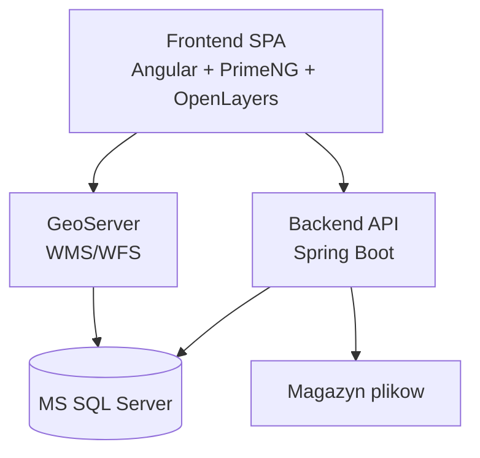

# Container Diagram

## Komentarz

- frontend obsluguje UX pracy na mapie, tabeli i formularzu,
- backend pozostaje wlascicielem procesu biznesowego, draftow i walidacji,
- GeoServer publikuje warstwy do odczytu i stylizacji,
- baza danych przechowuje stan operacyjny, referencyjny i raportowy.
