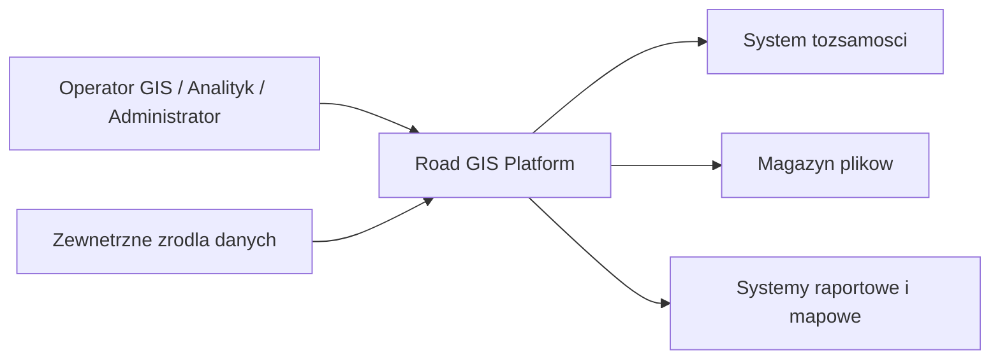

# Context Diagram

## Komentarz

Platforma jest centralnym systemem roboczym. Uzytkownicy pracuja w jednej aplikacji, natomiast system integruje tozsamosc, zalaczniki, importy oraz publikacje danych do konsumentow zewnetrznych.
