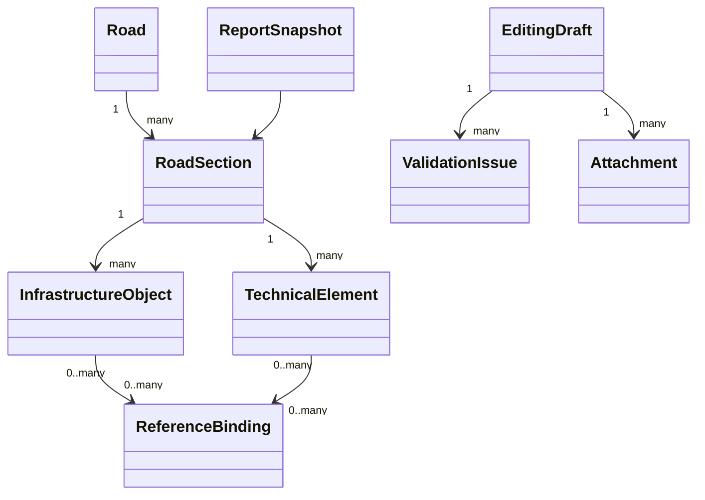

# Domain Model

## Cel modelu

Model domenowy porzadkuje odpowiedzialnosc za dane drogowe, ich geometrie, referencje oraz proces zmian. Ma wspierac jednoczesnie prace operacyjna, publikacje GIS i raportowanie.

## Glówne agregaty

| Agregat | Odpowiedzialnosc | Przykladowe atrybuty |
| --- | --- | --- |
| `Road` | opisuje droge jako logiczna trase lub ciag drogowy | numer, klasa, zarzadca, status |
| `RoadSection` | pierwszy agregat edycyjny MVP, reprezentuje odcinek roboczy lub ewidencyjny drogi | kilometraz od-do, geometria, binding referencyjny, status utrzymania |
| `InfrastructureObject` | grupuje obiekty zwiazane z pasem drogowym | typ, identyfikator terenowy, geometria, wlasciciel |
| `TechnicalElement` | opisuje punktowe lub liniowe skladniki infrastruktury | rodzaj, stan, data montazu, powiazanie z odcinkiem |
| `ReferenceBinding` | utrzymuje powiazanie obiektu z systemem referencyjnym drogi | segment referencyjny, kilometraz od-do, metoda dowiazania, jakosc, zgodnosc geometrii |
| `EditingDraft` | zbiera zmiany robocze i decyzje publikacyjne | autor, zakres, status, data walidacji |
| `ValidationIssue` | przechowuje wynik naruszenia reguly lub konfliktu | kod reguly, poziom, lokalizacja, opis |
| `Attachment` | reprezentuje plik dowodowy powiazany z obiektem lub draftem | typ pliku, lokalizacja, metadane, autor |
| `ReportSnapshot` | materializuje stan danych dla raportowania | typ raportu, zakres, data generacji, wersja danych |

## Relacje

## Zasady domenowe

1. Dane opublikowane sa zrodlem raportowym i nie moga byc modyfikowane poza procesem draft/publish.
2. Kazdy obiekt operacyjny musi miec stabilny identyfikator biznesowy niezalezny od klucza technicznego bazy.
3. Obiekt przestrzenny musi nalezec do jawnie okreslonego ukladu odniesienia i miec przypisany kontekst odcinka drogi lub jednostki terenowej.
4. Publikacja nie jest mozliwa, jesli draft zawiera bledy krytyczne walidacji.
5. Zalaczniki dziedzicza kontekst bezpieczenstwa i audytu obiektu lub draftu, do ktorego sa przypisane.
6. Raporty sa generowane ze stanu opublikowanego, a nie z draftow roboczych.

## Obiekty wspierajace

- `DictionaryEntry` dla slownikow centralnych,
- `AdministrativeUnit` dla wojewodztw, rejonow i jednostek utrzymaniowych,
- `ImportJob` dla wsadowych dostaw danych,
- `ChangeSet` jako wewnetrzna reprezentacja pakietu zmian w drafcie.

## Zdarzenia domenowe

- utworzenie draftu dla zakresu zmian,
- zakonczenie walidacji draftu,
- publikacja zestawu zmian,
- odrzucenie publikacji,
- dolaczenie lub usuniecie zalacznika,
- zakonczenie importu i wygenerowanie raportu walidacyjnego.

## Pytania do doprecyzowania w kolejnym etapie

- czy `RoadSection` ma byc glownym agregatem edycyjnym dla wszystkich obiektow terenowych,
- jaki jest dokladny model wersjonowania geometrii i atrybutow,
- ktore referencje sa lokalne, a ktore synchronizowane z systemow zewnetrznych,
- jaki zakres raportow ma byc materializowany, a jaki wyliczany dynamicznie.
